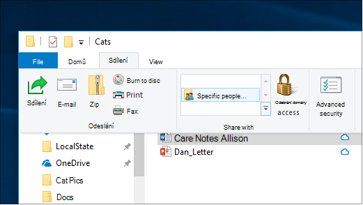

# Sdílení souborů přes síť ve Windows 10

**Poznámka:** Pokud jste dříve používali domácí skupinu pro sdílení souborů, vezměte prosím na vědomí, že domácí skupina byla odebrána ze systému Windows 10 (verze 1803). Nyní můžete sdílet tiskárny a soubory pomocí integrovaných funkcí ve Windows 10.

**Sdílení souborů nebo složek v síti**

- V **Průzkumníkovi souborů**vyberte soubor, > klikněte na kartu **Sdílet** v horní > v části **Sdílet s** klikněte na Konkrétní **lidé**.

    
          
- Pokud vyberete více souborů najednou, můžete je sdílet všechny stejným způsobem. Funguje to i pro složky.

**Zobrazení zařízení v síti, která sdílejí soubory**

- V **Průzkumníkovi souborů**přejděte na **Síť**. Pokud zjišťování sítě není povoleno, zobrazí se chybová zpráva "Zjišťování sítě je vypnuto..."

- Klikněte na nápis **Zjišťování sítě je vypnutý** a potom klikněte **na Zapnout zjišťování sítě a sdílení souborů**.

    

[Další informace o sdílení souborů v síti](https://support.microsoft.com/help/4092694/windows-10-file-sharing-over-a-network)

[Sdílení souborů pomocí aplikací, OneDrivu, e-mailů a dalších](https://support.microsoft.com/help/4027674/windows-10-share-files-in-file-explorer)
