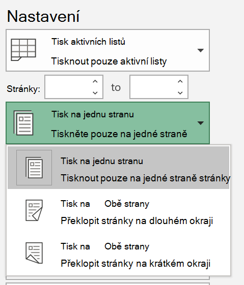
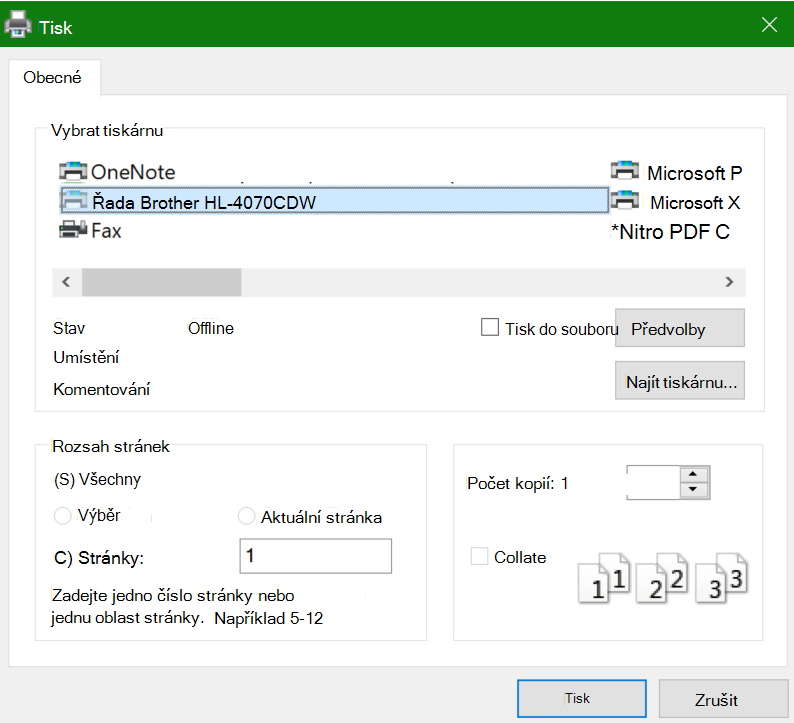

# Tisk na obě strany papíru (oboustranný tisk)Printing on both sides of paper (duplex printing)

**Je tiskárna schopna oboustranného tisku?****Is my printer capable of duplex printing?**

Souhrn funkcí tiskárny nebo příručka by měla sdělit, zda je schopna tisknout na obě strany papíru, označovaná také jako oboustranný tisk.Your printer’s feature summary or manual should tell you whether it is capable of printing on both sides of the paper, also known as “duplex printing.” Pokud máte Microsoft Office, další způsob, jak to zjistit, je otevření aplikace Office, jako je Word nebo Excel, jít do **souboru > tisk**, ujistěte se, že je vybrána správná tiskárna, a hledáte možnosti v části Nastavení.If you have Microsoft Office, another way to find out is by opening an Office app like Word or Excel, going to **File > Print**, making sure the right printer is selected, and looking for the capability in the Settings section. Příklad:For example: 

**Oboustranný tisk v sadě Microsoft Office****Duplex printing in Microsoft Office**

Pokud je tiskárna schopná tisknout na obě strany, zobrazí se při přepnutí do **souboru > tisk** v aplikaci Office možnost "Tisknout na obě strany", jak je znázorněno na příkladu výše.If your printer is capable of printing on both sides, when you go to **File > Print** in the Office app, you will see an option to “Print on Both Sides,” as shown in the example above.  Vyberte požadovaný typ oboustranného tisku (překlopit na dlouhou hranu nebo překlopení na krátké hraně) a klepnutím na **tlačítko Tisk** spusťte výtisk.Select the type of duplex printing you want (flip on long edge, or flip on short edge), and click **Print** to start the printout.

**Oboustranný tisk z libovolné aplikace****Duplex printing from any application**

V mnoha aplikacích při tisku uvidíte obecné tiskové dialogové okno, které vypadá takto:In many apps when you print you will see a general print dialog that looks like this: 

Zkontrolujte, zda je vybraná pravá tiskárna, a klepnutím na **předvolby** otevřete okno předvoleb tiskárny.Make sure the right printer is selected, then click **Preferences** to open the printer preferences window. Pokud je tiskárna schopna oboustranného tisku, zobrazí se v tomto okně možnost povolit tuto funkci pro aktuální tiskovou úlohu.If the printer is capable of duplex printing, the ability to enable this for the current print job will show in that window.
